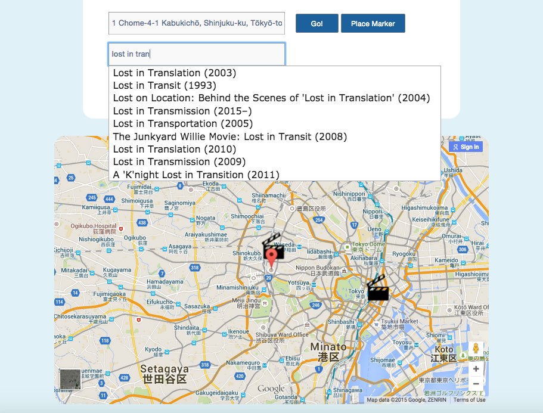

[](https://travis-ci.org/andygout/Movie-Snaps)  [](https://coveralls.io/r/andygout/Movie-Snaps)


Movie-Snaps
===================


Collaborators:
-----

[Jennifer Arad-Marks](https://github.com/curlygirly)

[Andy Gout](https://github.com/andygout)

[Ashleigh Maund](https://github.com/ashleigh090990)

[Stefan Lissia](https://github.com/stefan22)

[Tim Oxman](https://github.com/timoxman)

[Daryl Watson](https://github.com/dwatson62)


Kanban Board:
-----

[Waffle Board](https://waffle.io/timoxman/Movie-Snaps)


Brief:
-----

Movie Snaps is a website app you can use to record visits you make to movie locations across the world. You can create new visits, adding a photo (with caption) of yourself re-enacting your chosen scene, which can then be liked and commented upon by other users.

Visitors can search the site and view the visits relating to specific locations, movies and users.


Original pitch:
-----

*Locations where films were shot often prove popular tourist destinations: the Ghostbusters Firehouse in New York; Amelie's Cafe des Deux Moulins in Paris; the Park Hyatt Tokyo where Bob and Charlotte connect whilst Lost In Translation; Hobbiton in New Zealand, to name but a few.*

*As a movie lover, imagine going on holiday and having an app that pinpoints where scenes from your favourite movies were shot, ranging from the biggest blockbusters to more arthouse indie fare.*

*My Movie Holiday uses a user-compiled database of locations that hooks up to a movie API and Google Maps to create an ever-growing worldwide map of places to add to your holiday itinerary.*

*So as to expand the site's community, dedicated users will be able to post photos/videos of themselves at locations re-enacting the iconic scenes once shot there.*


Live demo on Heroku:
-------

[Movie-Snaps](https://moviesnaps.herokuapp.com/)


Technologies used:
-------

* Ruby on Rails web application framework
* ActiveRecord (database query interface) with PostgreSQL database
* Javascript
* jQuery
* Tested with RSpec, Capybara, Poltergeist headless browser on Selenium Driver
* Photos saved to Amazon Web Services: S3 (Simple Storage Service)
* API calls made to GoogleMaps and OMDb API (The Open Movie Database)


Site setup:
-------

- Configuration
    Rails should be installed via the cmd: gem install rails
    To get this application running locally, pull the repo from GitHub. Add file `.env` (does not appear in the repo because it's included in `.gitignore`) to your root directory and add the below (with requisite IDs and App secrets):
    ```
    FACEBOOK_APP_ID=
    FACEBOOK_APP_SECRET=
    S3_BUCKET_NAME=
    AWS_ACCESS_KEY_ID=
    AWS_SECRET_ACCESS_KEY=
    ```

- Database creation
    `$ bin/rake db:create` (`$ bin/rake db:migrate` if you have a previous version of the app)

- To run the site on a local server
    `$ bin/rails s`


Testing setup:
-------

- Run RSpec tests: `$ rspec`


User stories:
-------

```
As a film buff on holiday
So that I can visit famous film locations
I would like to see a map of where they are

As a film aficionado who likes indie films
So that I can share my favorite film locations
I would like to add a clip board marker to the map

As a film lover who loves taking selfies
So that I can log visits to marked film locations
I want to upload them specifying a movie and location with image upload

As a nostalgic
So that I can review all my visits to movie locations
I would like to see a page listing them

As a competitive selfie taker
So that I can compare my reenactment photos
I would like to see a listed display of other users' photos

As an obsessive social media user
So that I can support my selfie loving friends
I would like to 'like' their fab film selfies

As an obsessive social media user
So that I can support my selfie loving friends
I would like to comment or how awsome their pics are

As a visitor to a particular location
So that I can view visits info/photos relating to that location
I would like to see a listed display

As a fan of a particular movie
So that I can view visits info/photos relating to that movie
I would like to see a listed display

As a fan of a particular scene in a movie
So I can view visits info/photos relating to that scene
I would like to see a listed display

As a movie snaps admin
So that I can protect my users and monitor content
I would like users to be signed in to upload pictures and contribute

As a movie snap admin
So that that I can entice new users
I would like to the homepage to display user visits info/photos
```


Learning:
-------

- Building the app gave us a significant amount of experience working with GoogleMaps, allowing us to find a location by entering an address into an autocomplete field linked to the GoogleMaps API and then selecting a location by clicking directly on the map (giving the longitude and latitude to be saved in the database as reference).

- The movie field's autocompletion was achieved by hooking up to the OMDb API. Ideally we would have liked accompanying poster images to appear next to each respective title, but this required a second API call for each of the titles generated by the first API call, which created some involved callback issues. While we managed to get this working, it was temperamental and rearranged the desired order of the list (as created by the initial call alone).

- Given the scope of the site and the amount of inherent relationships between various models, we collectively devised the schema, the process forcing us to dispel our preconceptions and address the exact definitions of our models: what constituted a visit? a scene?, etc. and how those linked to one another. I would have preferred each visit to have only included a single image upload and accompanying caption so that we'd be working to a more feasible MVP (minimum viable product) given the build timeframe of two weeks, rather than the actual schema (each visit having a description and potentially multiple photos, and each of those also having their own caption (although we only implemented the ability to upload a single image)), which ultimately created a lack of clarity of each model's responsibility and I'd argue would not even be necessary in a longer term version of the project, but which in this scenario diplomacy demanded.

- The process of selecting a movie and location (which by combination would create a scene) used a substantial amount of JavaScript while the subsequent steps of compiling the details of the visit itself (description; date of visit; photo caption; image file upload) was easily achieved using Rails. This meant that creating a visit was a two-step process, impeding the flow of what should, by specification, be a quick, fun and easy-to-use app. It also meant that scenes could be saved to the database and then the creation process abandoned, leaving scenes unlinked to any particular visit. If revisiting the app I'd like to address consolodating the entire visit creation process in one fell swoop.


Next steps:
-------

- Develop the site as a mobile app, especially given its nature, it's something you'd want access to when out and about on holiday; research was done into achieving this with Swift or Ionic

- Functionality to upload a scene screenshot from the given film to compare users' photos against

- Locations index page - allowing users to explore GoogleMaps and inspect flags pinpointing locations where previous users have visited and uploaded photos

- Employing further CSS styling to prevent images from stretching


Links:
-------

[OMDb API](http://www.omdbapi.com/)


Images:
-------

#### Welcome Page (i)


#### Welcome Page (ii)


#### Scene Select Page


#### Visit Add Page


#### User Page


#### Location Page


#### Movie Page
